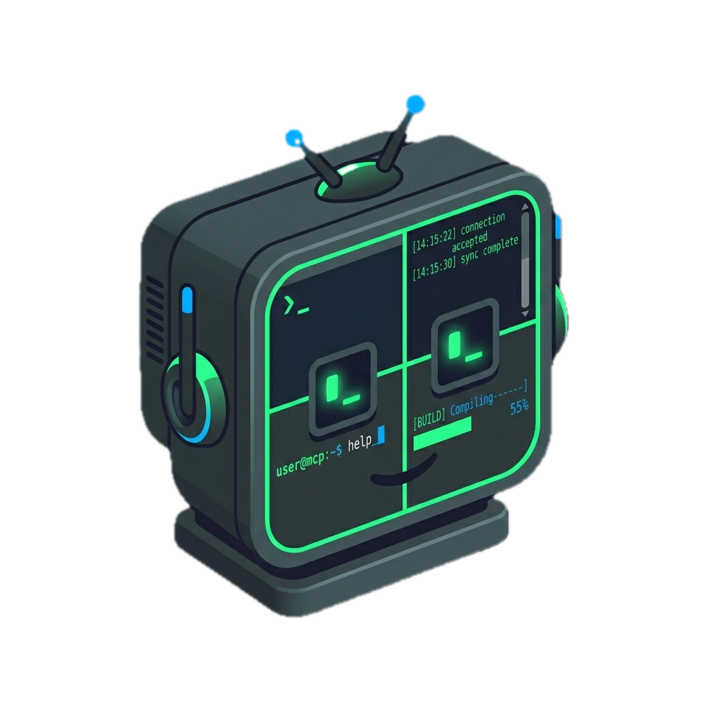

# tmux-mcp

<p align="center">
  
</p>

MCP server that gives AI assistants full visibility into your tmux sessions — browse sessions, windows, and panes, read terminal output, and send commands.

Works with **Claude Code, OpenCode, Cursor, Windsurf**, and any MCP-compatible host.

## What it can do

**Read your terminal state**
- List every active tmux session with window count, creation time, and attached status
- List windows inside a session — index, name, pane count, which one is active
- List panes inside a window — size, running command, which one is active

**See what's on screen**
- Capture the visible output of any pane — up to 5 000 lines of scrollback
- Read logs, compiler errors, server output, test runs — anything in your terminal

**Create and organise**
- Create sessions, windows, and panes with a working directory and an initial command
- Split panes horizontally or vertically
- Rename sessions and windows for reliable targeting

**Clean up**
- Kill sessions, windows, or individual panes

**Control panes**
- Send shell commands to any pane and immediately read the output
- Send raw key sequences: `C-c` to interrupt, `Escape` to exit, arrow keys, etc.
- Configurable wait time before capturing so long-running commands have time to finish

**Error-safe**
- Bad target? No tmux server? Returns a readable error message instead of crashing

## Tools

### `list_sessions`
Lists all active tmux sessions. No parameters.

Returns: session name, number of windows, creation time, attached/detached status.

### `list_windows`
Lists windows inside a session.

| Parameter | Type | Description |
|---|---|---|
| `session` | string | Session name (from `list_sessions`) |

Returns: window index, name, pane count, whether it's the active window.

### `list_panes`
Lists panes inside a session or window.

| Parameter | Type | Description |
|---|---|---|
| `target` | string | Session name (`work`) or `session:window` (`work:0`) |

Returns: pane index, title, dimensions (e.g. `220x50`), whether it's active, running command.

### `capture_pane`
Captures the current terminal output of a pane.

| Parameter | Type | Default | Description |
|---|---|---|---|
| `target` | string | — | Pane target: `session:window.pane` (e.g. `work:0.0`) |
| `lines` | number | `150` | Lines of scrollback to include (max 5000) |

Returns: raw terminal text as it appears on screen.

> **Security note:** pane output can contain environment variables, API keys, tokens, and credentials if they were printed to the terminal. Only use this server in trusted local environments.

### `send_keys`
Sends a command or key sequence to a pane and captures the result.

| Parameter | Type | Default | Description |
|---|---|---|---|
| `target` | string | — | Pane target: `session:window.pane` |
| `keys` | string | — | Command or tmux key notation (`C-c`, `Escape`, `Up`, etc.) |
| `enter` | boolean | `true` | Press Enter after the keys |
| `capture_lines` | number | `50` | Lines to capture after sending |
| `wait_ms` | number | `400` | Milliseconds to wait before capturing |

Returns: confirmation + pane output after the command ran.

### `new_session`
Creates a new detached tmux session.

| Parameter | Type | Description |
|---|---|---|
| `name` | string | Session name. Omit to let tmux auto-assign one. |
| `cwd` | string | Working directory for the session. |
| `command` | string | Shell command to run immediately in the first window. |

### `new_window`
Creates a new window inside an existing session.

| Parameter | Type | Description |
|---|---|---|
| `session` | string | Session to create the window in. |
| `name` | string | Window name. |
| `cwd` | string | Working directory for the new window. |
| `command` | string | Shell command to run immediately. |

### `split_pane`
Splits a pane into two.

| Parameter | Type | Default | Description |
|---|---|---|---|
| `target` | string | — | Pane or window to split: `session:window.pane` |
| `direction` | `horizontal` \| `vertical` | `horizontal` | `horizontal` = left/right split, `vertical` = top/bottom |
| `cwd` | string | — | Working directory for the new pane. |
| `command` | string | — | Shell command to run in the new pane. |
| `size` | number | — | Size of the new pane as a percentage (1–99). |

### `kill_session`
Kills a session and all its windows and panes. **Destructive — cannot be undone.**

| Parameter | Type | Description |
|---|---|---|
| `session` | string | Session name to kill. |

### `kill_window`
Kills a window and all its panes. **Destructive.**

| Parameter | Type | Description |
|---|---|---|
| `target` | string | Window target: `session:window` |

### `kill_pane`
Kills a single pane and its running process. **Destructive.**

| Parameter | Type | Description |
|---|---|---|
| `target` | string | Pane target: `session:window.pane` |

### `rename_session`

| Parameter | Type | Description |
|---|---|---|
| `session` | string | Current session name. |
| `new_name` | string | New name. |

### `rename_window`

| Parameter | Type | Description |
|---|---|---|
| `target` | string | Window target: `session:window` |
| `new_name` | string | New name. |

## Target format

All tools use tmux's standard `session:window.pane` notation:

```
work           →  session named "work"
work:0         →  window 0 of session "work"
work:0.0       →  pane 0, window 0, session "work"
work:editor.1  →  pane 1 of window named "editor" in session "work"
```

Use `list_sessions` → `list_windows` → `list_panes` to discover the right target before calling `capture_pane` or `send_keys`.

## Install

```bash
npm install -g @fr1sk/tmux-mcp
```

## Configure

### OpenCode (`~/.config/opencode/opencode.json`)

```json
{
  "mcp": {
    "tmux": {
      "type": "local",
      "command": ["tmux-mcp"]
    }
  }
}
```

### Claude Code (`~/.claude/settings.json`)

```json
{
  "mcpServers": {
    "tmux": {
      "command": "tmux-mcp"
    }
  }
}
```

### Cursor / Windsurf (`mcp.json`)

```json
{
  "mcpServers": {
    "tmux": {
      "command": "tmux-mcp"
    }
  }
}
```

## Usage examples

```
What tmux sessions do I have running?
```
```
Show me the output of my dev server — it's in the work session
```
```
My tests are failing, check what's in work:1.0
```
```
Run git status in my work session and show me the output
```
```
Send Ctrl-C to work:0.0, the process is stuck
```
```
Tail the last 300 lines from the logs pane in my api session
```
```
Create a new session called 'dev' in ~/Projects/myapp and run npm run dev
```
```
Split work:0.0 vertically and run npm test in the new pane
```
```
Rename session 'new' to 'api'
```
```
Kill the old session named 'temp'
```

## Environment variables

Set these in your MCP client config under `environment` to control agent behavior.

| Variable | Default | Description |
|---|---|---|
| `TMUX_MCP_DEFAULT_SESSION` | — | Session name the agent routes commands to when `alwaysUseTmux` is on |
| `TMUX_MCP_ALWAYS_USE` | `false` | Set to `"true"` to route all shell commands through tmux instead of direct Bash |

When both are set, the `get_config` tool returns an `instructions` field the agent uses to automatically route every shell command through `send_keys` in the configured session.

Example (OpenCode):

```json
{
  "mcp": {
    "tmux": {
      "type": "local",
      "command": ["tmux-mcp"],
      "environment": {
        "TMUX_MCP_ALWAYS_USE": "true",
        "TMUX_MCP_DEFAULT_SESSION": "dev"
      }
    }
  }
}
```

## Security

This server provides **unrestricted local shell access** through tmux:

- **`capture_pane`** — returns raw terminal output, which may include environment variables, API keys, tokens, database passwords, and SSH private keys if they were printed to the terminal.
- **`send_keys`** — executes arbitrary shell commands in the target pane. Any command the AI sends runs in your shell with your permissions.
- **`command` parameter** on `new_session`, `new_window`, and `split_pane` — passed directly to tmux, which runs it via `$SHELL -c`. No validation or sandboxing.

**Only use this server in trusted local development environments. Never expose it to network-accessible MCP hosts or untrusted AI assistants.**

## Requirements

- Node.js 18+
- tmux on `$PATH`
